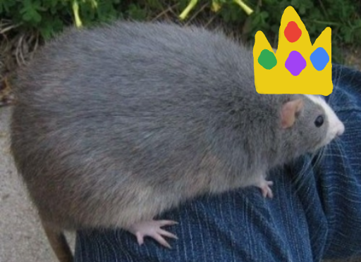

<!DOCTYPE html>
<html lang="en" title="big ratti">
    <head>
        <meta charset="utf-8"/>
        <meta http-equiv="X-UA-Compatible" content="IE=edge"/>
        <meta name="viewport" content="width=device-width, initial-scale=1, shrink-to-fit=no"/>
        <meta name="description" content=""/>
        <meta name="author" content=""/>
        <!-- Bootstrap core CSS -->
        <link href="../Documents/GitHub/rat/bootstrap_theme/bootstrap.css" rel="stylesheet" type="text/css"/>
        <!-- Custom styles for this template -->
        <link href="style.css" rel="stylesheet"/>
        <title>big ratti</title>
        <link rel="icon" href="kingbigrat.png" type="image/png"/>
    </head>
    <body>
        

        <!-- Bootstrap core JavaScript
    ================================================== -->
        <!-- Placed at the end of the document so the pages load faster -->
        <h1><b class="bg-white text-center text-danger">Louie Bigballs, the king of rattis..</b></h1>
        
 
            

                <h5 class="mt-0">your opinion doesnt matter.. i command you to pet me. or DIE!!! i will LAUNCH MY RATTI ARMY!!!</h5>
            
             
        

        
        <h2>ᘛ⁐̤ᕐᐷ
ᘛ⁐̤ᕐᐷ
ᘛ⁐̤ᕐᐷ
ᘛ⁐̤ᕐᐷ
ᘛ⁐̤ᕐᐷᘛ⁐̤ᕐᐷ
ᘛ⁐̤ᕐᐷ
ᘛ⁐̤ᕐᐷ
ᘛ⁐̤ᕐᐷ
ᘛ⁐̤ᕐᐷᘛ⁐̤ᕐᐷ
ᘛ⁐̤ᕐᐷ
ᘛ⁐̤ᕐᐷ
ᘛ⁐̤ᕐᐷ
ᘛ⁐̤ᕐᐷᘛ⁐̤ᕐᐷ
ᘛ⁐̤ᕐᐷ
ᘛ⁐̤ᕐᐷ
ᘛ⁐̤ᕐᐷ
ᘛ⁐̤ᕐᐷᘛ⁐̤ᕐᐷ
ᘛ⁐̤ᕐᐷ
ᘛ⁐̤ᕐᐷ
ᘛ⁐̤ᕐᐷ
ᘛ⁐̤ᕐᐷᘛ⁐̤ᕐᐷ
ᘛ⁐̤ᕐᐷ
ᘛ⁐̤ᕐᐷ
ᘛ⁐̤ᕐᐷ
ᘛ⁐̤ᕐᐷᘛ⁐̤ᕐᐷ
ᘛ⁐̤ᕐᐷ
ᘛ⁐̤ᕐᐷ
ᘛ⁐̤ᕐᐷ
ᘛ⁐̤ᕐᐷᘛ⁐̤ᕐᐷ
ᘛ⁐̤ᕐᐷ
ᘛ⁐̤ᕐᐷ
ᘛ⁐̤ᕐᐷ
ᘛ⁐̤ᕐᐷᘛ⁐̤ᕐᐷ
ᘛ⁐̤ᕐᐷ
ᘛ⁐̤ᕐᐷ
ᘛ⁐̤ᕐᐷ
ᘛ⁐̤ᕐᐷᘛ⁐̤ᕐᐷ
ᘛ⁐̤ᕐᐷ
ᘛ⁐̤ᕐᐷ
ᘛ⁐̤ᕐᐷ
ᘛ⁐̤ᕐᐷᘛ⁐̤ᕐᐷ
ᘛ⁐̤ᕐᐷ
ᘛ⁐̤ᕐᐷ
ᘛ⁐̤ᕐᐷ
ᘛ⁐̤ᕐᐷᘛ⁐̤ᕐᐷ
ᘛ⁐̤ᕐᐷ
ᘛ⁐̤ᕐᐷ
ᘛ⁐̤ᕐᐷ
ᘛ⁐̤ᕐᐷᘛ⁐̤ᕐᐷ
ᘛ⁐̤ᕐᐷ
ᘛ⁐̤ᕐᐷ
ᘛ⁐̤ᕐᐷ
ᘛ⁐̤ᕐᐷᘛ⁐̤ᕐᐷ
ᘛ⁐̤ᕐᐷ
ᘛ⁐̤ᕐᐷ
ᘛ⁐̤ᕐᐷ
ᘛ⁐̤ᕐᐷ RATTI ARMY!!!</h2>
        
        
        
    </body>
</html>
